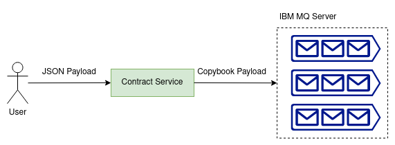

# [Ballerina] Contract service

This sample is based on a simple HTTP service that is used to persist and retrieve insurance contract details in JSON format. It performs two primary functions:

1. It accepts incoming insurance contract details in JSON format, converts them to copybook format, and publishes them to an IBM MQ queue instance.
2. Additionally, the service can also be utilized to retrieve the latest published contract details. In this case, the service retrieves the most recent message from the queue, transforms it into JSON format, and forwards it as the response.

|  | 
|:------------------------------------------------:| 
|      *Image 1: Current system overview*      |

## Prerequisites

- Ballerina 2201.8.4

## Generating the copybook definitions

- Go into the `contract-svc` directory and run the following command.

```sh
bal copybook -i resources/copybook.cpy
```

## Deploying the system

- Update the IBM MQ-related configurations in the `contract-svc/Config.toml` configuration file.

```toml
[ibmMqConfig]
name = "QM1"
host = "localhost"
port = 1414
channel = "DEV.APP.SVRCONN"
userID = "app"
password = "password"
sslCipherSuite = "*TLS12ORHIGHER"

[ibmMqConfig.secureSocket]
cert = "./<path-to-the>/ibm-mq-server.crt"
```

- Go into the `contract-svc` directory and run the following command.

```sh
bal run
```

## Test the system

- Install VSCode [REST client](https://marketplace.visualstudio.com/items?itemName=humao.rest-client) plugin. 
- Open the `contract.request.http` from the VSCode and execute the requests.
